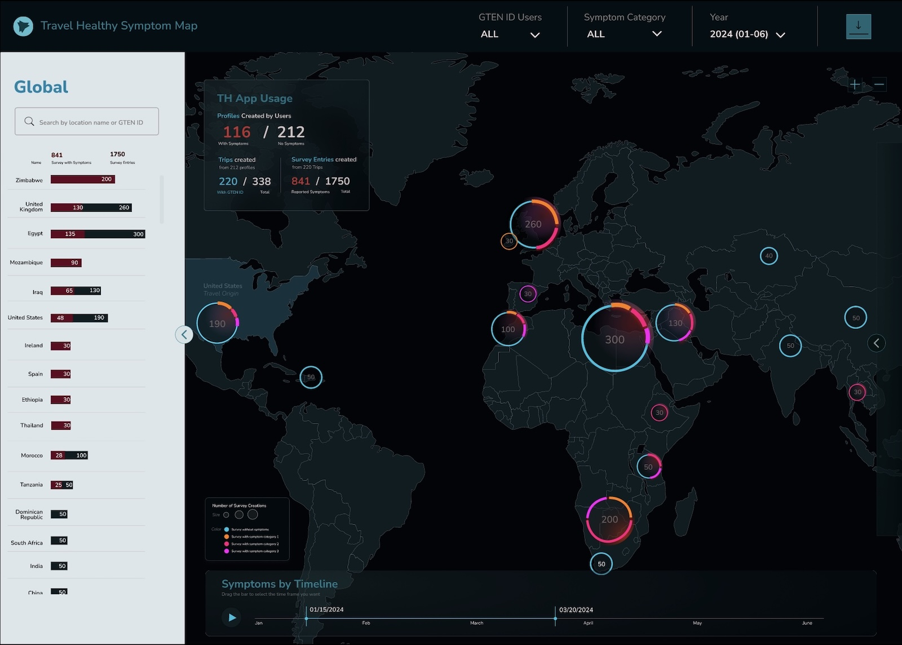
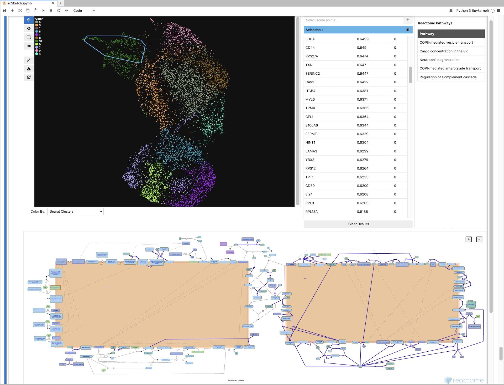
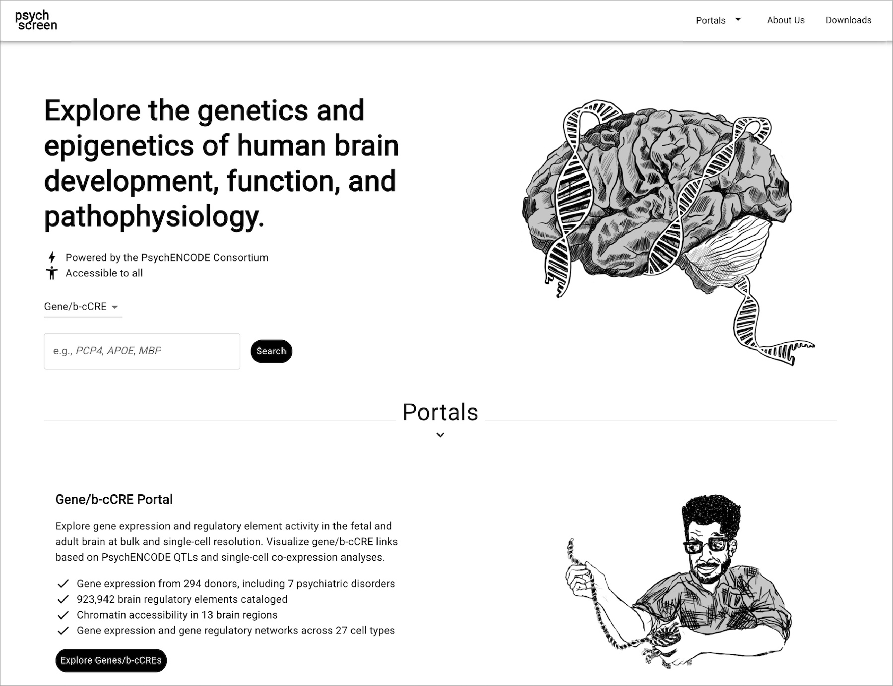
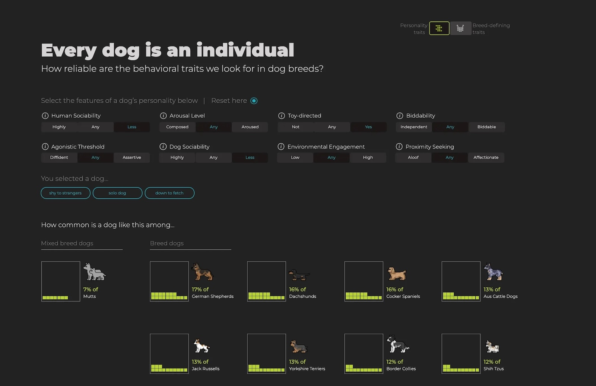

As data generation reaches scales never seen before, our capacity to translate vast, multi-modal datasets into clear and actionable insights is paramount. The Colubri Lab is committed to developing innovative data visualizations that are not only aesthetically compelling but are also built on rigorous statistical foundations and guided by the principles of user-centered design. We create tools that empower ourselves and others to explore, question, and understand complex information.

Our projects in this area are diverse, reflecting the varied needs of biomedical research. For <a href="https://gten.massgeneral.org/projects/travel-healthy-app/" target="_blank">Travel Healthy (TH)</a>, a participatory surveillance app platform for international travelers, we are designing and implementing a real-time web "dashboard" that visualizes travel-related illness reports, with the goal of providing public health officials with a timely and intuitive overview of potential health threats. In the realm of genomics, we are developing , a specialized visualizer for Jupyter notebooks that allow researchers to interactively explore massive single-cell RNA sequencing datasets, helping to uncover the cellular-level mechanisms of viral infections. By collaborating with the Weng and Moore labs in the department of Genomics and Computational Biology at UMass Chan, we were able to bring our user-centric approach to upgrade several portals from the <a href="https://www.encodeproject.org/help/project-overview/" target="_blank">ENCODE project</a>, including <a href="https://www.factorbook.org/" target="_blank">Factorbook</a> and <a href="https://psychscreen.wenglab.org/psychscreen" target="_blank">psychSCREEN</a>, making them much more visually pleasing and intuitive to use while keeping  all their advanced functionality needed by the researchers that rely on these tools to study gene regulation in health and disease.  In contrast to these large-scale projects, we also work on smaller, highly-focused visualization tools tailored to a specific dataset and use case. For instance, together with the Karlsson lab we created the <a href="https://darwinsarkdeve.wpengine.com/muttomics_viz_dashboard/" target="_blank">Muttomics web tool</a> to illustrate how the stereotypes associated to specific dog breeds may be less pronounced than we may think. Beyond all this, we constantly apply principles of information design and user experience throughout the tools we develop in our lab, including mobile apps for data collection such as TH and <a href="https://epidemica.info/" target="_blank">Epigames</a>, as well as the recently launched community science platform, <a href="https://www.pounceforscience.org/" target="_blank">Pounce!</a>. This involves a constant cylce of collection and analysis of users' feedback, followed by refinements in response to that feedback.

*
Clickable mockup of the Travel Healthy dashboard.
*

*
scSketch single-cell data visualizer for Jupyter notebooks.
*

*
psychSCREEN portal to explore genetics and epigenetics of human brain development, function, and pathophysiology.
*

*
Muttomics web visualization of behavioral and physical traits from dogs.
*

###  Interactive Exploration of Single-cell Datasets Guided by Online False Discovery Testing

We are particularly interested in the following problem posed by interactive data exploration. On one hand, interactive data exploration affords the user with significant freedom (only constrained by the interface of the visualization tool) to find interesting patterns in the data, but, on the other hand, <a href="https://ieeexplore.ieee.org/document/9779102" target="_blank">each new view, selection, or query is an implicit hypothesis test</a>, and without some kind of "online" error control, researchers can easily be misled by random noise. This problem of multiple hypothesis testing can lead to a high rate of false discoveries, undermining the reproducibility of scientific findings. Our scSketch project will directly address this issue by integrating a framework for online False Discovery Rate (FDR) control into the exploratory process.

When a researcher uses scSketch to draw a direction on a cell embedding, the tool will test thousands of genes for significant correlation with that trajectory. This process is repeated with every new user-generated sketch, creating a sequence of many statistical tests. To manage the error rate across this entire interactive session, we are implementing an advanced online FDR algorithm (<a href="https://dsrobertson.github.io/onlineFDR/articles/onlineFDR.html" target="_blank">LORD++</a>). This method adaptively adjusts the significance threshold for each new test based on the discoveries made in all previous steps.

This approach provides a quantitative safety net for the user, ensuring that the proportion of false positives among all discovered gene associations remains controlled below a pre-specified level. By embedding rigorous error control directly within the user interface, we will provide interactive visualization with a statistically sound and reproducible method for hypothesis generation, giving researchers greater confidence in the biological insights they uncover.