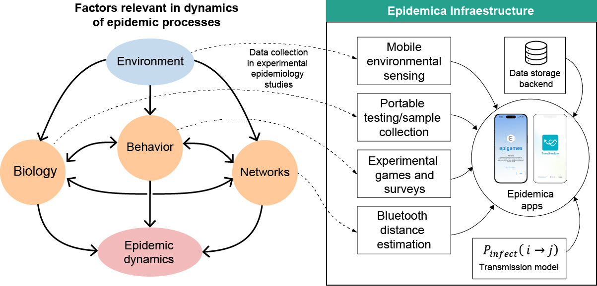

The study of how infectious diseases spread is often limited by the difficulty to experimentally study transmission events in real-time under different contexts. To overcome this challenge, our lab creates novel digital tools for "experimental epidemiology." This work builds on the success of the <a href="https://operationoutbreak.org/" target="_blank">Operation Outbreak</a> (OO) project—an educational app-based platform <a href="https://www.wired.com/story/opinion-disease-simulation/" target="_blank">created by PI Colubri and his collaborators</a> at the Broad Institute of Harvard and MIT back in 2017-18 (<a href="https://pubmed.ncbi.nlm.nih.gov/32905783/" target="_blank">Colubri et al., Cell 2020</a>), and deployed since then in over 100 live simulations with more than 10,000 participants. Based in part on the lessons learned from OO, and incorporating ideas from game theory, proxemics, and behavioral research, we are developing <a href="https://epidemica.info/" target="_blank">Epidemica</a>, a next-generation platform for open-source, modular experimentation in epidemiology. 

*
Diagram of the planned Epidemica platform, some of its features are being implemented in the ongoing Epigames and Travel Healthy apps.
*

We are currently fleshing out the architecture and requirements of the full Epidemica platform as we develop the first two Epidemica-based apps: Epigames and Travel Healthy.

###  Epigames: An App for Experimental Epidemic Games

Experimental epidemic games, or "epigames" for short, are gamified experiments in everyday settings (such as conferences, schools, or workplaces), where participants play out an outbreak scenario via some mechanism that simulates transmission of an infectous agent between them. We have created the Epigames app to offer a realistic implementation of these experiments, and to allow participants make decisions in response to the spread of the simulated pathogen between their phones via Bluetooth connectivity. This app is specifically designed to study the interplay between infectious disease spread, social contact networks, and human behavior.

*
Early Epidemic game at a collegue campus. Students using the app (A). Screens showing (left to right) sick avatar, quarantine option, and interface while in quarantine (B). Largest connected transmission tree from the game (C). Histogram showing attitudinal responses collected through the app (participants’ perceptions about quarantine) (D).
*

In 2023–2024, a proof-of-concept version of Epigames, based off the OO app originally developed by Colubri, was piloted at different locations around the globe, including Wenzhou-Kean University (WKU, China), ADUSTECH (Nigeria), Murdoch University (Australia), Penn State University (USA), and officially launched at the International Pandemic Sciences Conference in 2025. The epigame at WKU in the Fall 2023, where nearly 1,000 students participated in a two-week epidemic game designed to study the impact of quarantine decisions under conditions simulating trade-offs between individual and collective benefits, is notable because is the largest and longest to date (results published in <a href="https://www.medrxiv.org/content/10.1101/2024.12.14.24318955v2" target="_blank">Musa et al., medRxiv 2024</a>, with some highlights in the figure above). Our analyses demonstrated that even substantial behavioral adherence to containment measures may not yield anticipated reductions in transmission due to complex network effects and behavioral feedback loops. These simulations also reproduced known epidemiological phenomena, such as superspreading, supporting the external validity of the approach. This is important because it means that findings from the game context may translate over to real life situations.

At this time, we are working on systematically assessing the external validity of the epigames, as well as deploying them in diverse settings beyond schools and conferences. If the observations and data from the epigames exhibit a reasonable level of validity in non-game settings, they could serve as the closest ethical proxy to observing an actual pathogen's spread, providing a sandbox to test the effectiveness of different public health interventions, such as vaccination strategies, social distancing protocols, or information campaigns. Furthermore, the data collected from these experiments would feed directly into our modeling efforts, allowing us to build more realistic and predictive simulations of real-world outbreak scenarios.

### Participatory Surveillance for International Travelers: The Travel Healthy app

We designed and developeed the <a href="https://gten.massgeneral.org/projects/travel-healthy-app/" target="_blank">Travel Healthy (TH) mobile app</a> in close partnership with the Travelers’ Advice and Immunization Center at Massachusetts General Hospital. The TH project is meant to address gaps in traditional travel surveillance—which typically collects data only before and after trips—TH enables U.S. travelers to submit daily symptom surveys and location data throughout the duration of their travel. 

*
Screens of the current version of the Travel Healthy app (top row), including home screen, symptom calendar, symptom survey, malaria  reminder, and travel health notices tool. Bar chart showing frequency of reported symptoms (bottom left), and worldmap with distribution of daily surveys reported between launch in July 2023 and end of June 2025 (bottom right).
*

The app also includes traveler tools such as outbreak notifications, a travel document wallet, and malaria medication reminders. Developed with a meticulous user-centric design process, which started with a detailed user survey to identify the needs of travelers (<a href="https://pubmed.ncbi.nlm.nih.gov/37410376/" target="_blank">Machoko et al., Journal of Travel Medicine 2024 </a>) and resulted in <a href="https://ux-design-awards.com/winners/2024-2-travel-healthy" target="_blank">a nomination for the UX Design Awards in 2024</a>, TH was enrolled hundreds of international travelers since launch in November 2023, who have submitted more than 5000 daily symptom reports across over 800 travel destinations. This project demonstrates the feasibility and value of participatory, app-based surveillance for real-time monitoring of global health risks, and lays the foundation for constructing AI/ML models for personalized recommendations and outbreak detection using self-reported data.