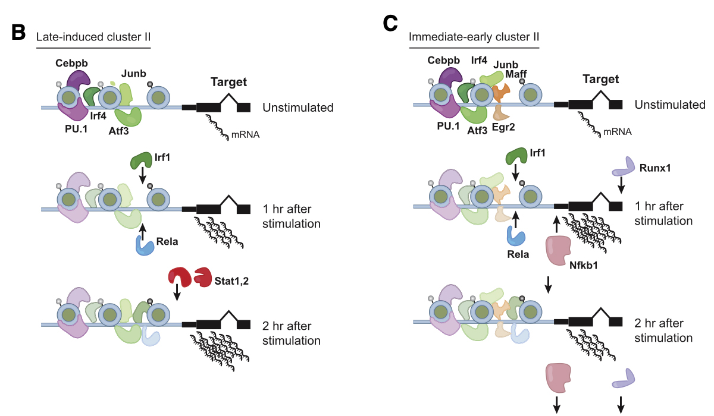

Availability of biomedical datasets of increasing size and complexity gives opportunities to create new visualization tools to gain insight from these datasets. With my work with [Processing](https://processing.org/) I wanted to bring science into art - that experience motivated me to now bring art into science by creating new scientific visualization tools and to be able to find possible answers to the question: what are the “next generation” visualization methods for biomedical data?

<!--more-->

Here, with term "biomedical" I include any genomic-related datasets (sequencing, gene expression, etc.) as well as genotype-associated metadata (such as demographic information, phenotypic variables) and purely medical datasets (electronic health records, population-level prevalence of diseases, and others). Each kind of dataset have unique requirements in terms of applications, scale, nature of the data itself, that pose specific constraints to the design and implementation of visualization tools. In the lab, we will apply user experience and information design techniques to each one of these problems to create tools that provide effective means to explore such datasets and extract useful insights from them. From a more theoretical perspective that enconpasses all of these different contexts, we are interested in how to deal with the problem of "false discovery" in the context of interactive visualization. Keep reading for more details :-)

## Dynamic multiple hypothesis correction in interactive visualization

We need novel approaches to reduce biases and better understand the models derived from large biomedical datasets. One problem that is gaining recognition among specialists is that of biases due to exploratory analysis ([Gotz et al., 2017](https://dl.acm.org/doi/pdf/10.1145/3009973)). Interactive visualization can lead to insights from complex datasets, however, it also makes it very easy to implicitly test a vast number of statistical hypothesis (e.g.: are pairs of variables correlated, are the means of two distributions the same), with the corresponding increasing chance of false discoveries that affect the subsequent analysis and modeling processes. I have conducted initial work on this issue with the tool [Mirador](https://fathom.info/mirador/):

`video: https://vimeo.com/535236819`

Our plan at CoLabo is to investigate it further by developing statistical formalisms to measure the false discovery rates associated with different types of interactive visualizations, and designing interaction methodologies to keep users aware of possible false discoveries. I find the question of “how interfaces for data visualization can be quantified in terms of their statistical effects in model building” to be a very relevant and exciting problem, since it sits squarely at the intersection of machine learning, data visualization, and user interface design. Working with popular frameworks for visualization and computational design, such as Processing and D3, will allow us to maximize the reach of our research to audiences of experts and beginners alike.

## Visualization of genomic datasets

New experimental techniques ([RNA-seq](https://www.nature.com/articles/s12276-018-0071-8), [ChIP-seq](https://www.nature.com/articles/nrg2641)) generate not only very large datasets, but also highly dynamic data that changes over time. We aim at creating novel visualization tools that allow to explore these datasets and generate hypothesis of time-based processes, such as regulatory networks and single-cell gene expression data. We are interested in developing new technologies that facilitate interactive exploration as part of larger data analysis pipelines, while based on rigorous statistical foundations to quantify the possibility of false discoveries during this exploration.

Some preliminary work I have done in this area and will continue at CoLabo are visualization of Multiple Sequence Alignment (MSA) using design principles to reduce congnitive load and handle very large MSA datasets ([NX4 project](https://www.nx4.io/)):

`video: https://vimeo.com/535235717`

A more recent project is an interactive viewer for single-cell RNA-seq datasets that can be embedded into Jupyter notebooks, this project is ongoing and its source code [available online](https://github.com/colabobio/embedview), the video below shows an early prototype:

`video: https://vimeo.com/535239159`

Finally, an interesting problem came up from conversations with my colleague at BIB, Manuel Garber, in the context of using ChIP-seq data to map plausible hypothesis of gene regulation events over time ([Vangala et al., 2020](<https://www.cell.com/molecular-cell/fulltext/S1097-2765(20)30613-4>)). In theory, an animation per promoter could be made that integrates all measurements into something like the cartoon, with the difference that it will not be a cartoon but a visualization/interpretation of the data generated:

The same general problem noted before remains in this context, if the visualization is able to generate multiple visual hypothesis for the regulation of a given gene, how do we attach a statistical significance at the stage of the interactive exploration itself?
