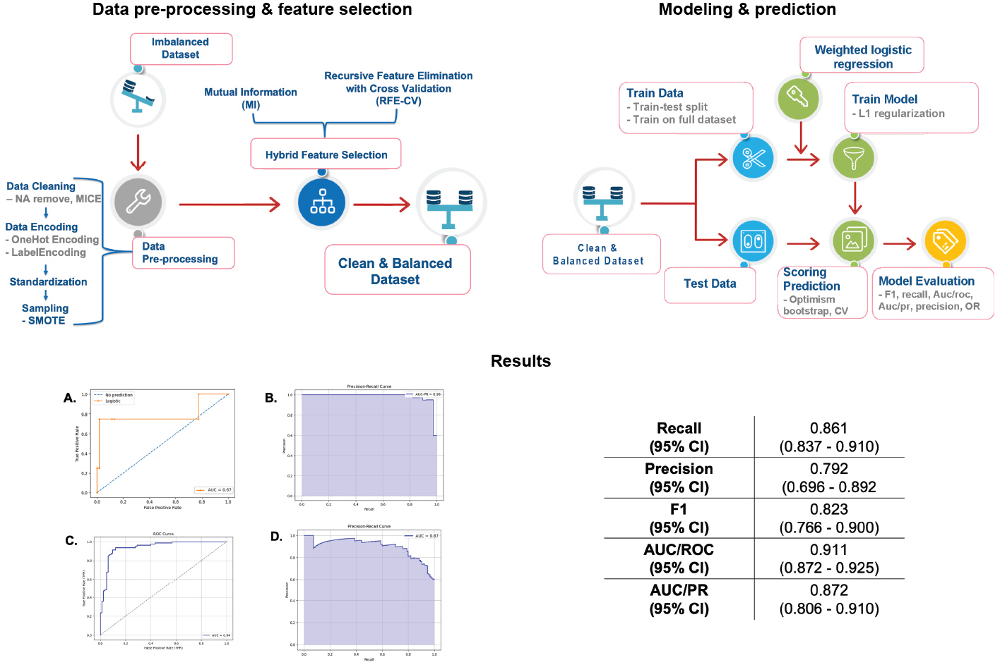
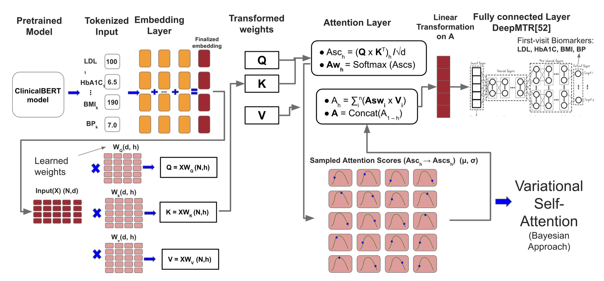

Our lab specializes in constructing sophisticated AI and machine learning models to forecast disease outcomes and trajectories, with a strong focus on the challenges presented by real-world data. We believe that for predictive models to be truly effective in healthcare, they must be robust enough to handle the sparse, noisy, and incomplete datasets often found in emergency situations and resource-limited environments. An example of this approach is the ongoing work of PhD candidate <a href="https://www.umassmed.edu/news/news-archives/2025/03/phd-candidate-winnie-mkandawire-impacted-by-grief-and-driven-by-hope-studies-disease-outbreak-modeling" target="_blank"> Winnie Mkandawire</a>, who is developing a diagnostic-driven, uncertainty-aware pipeline for predicting Lassa fever outcomes, building on her earlier work in the lab on deriving diagnostic models from unbalanced datasets (<a href="https://www.nature.com/articles/s41467-024-44800-7" target="_blank">Levine et al., Nature Communications 2024</a>). This framework moves beyond one-size-fits-all methods by first diagnosing data irregularities—such as non-random missingness and class imbalance—to inform tailored preprocessing and modeling strategies, ensuring that the final predictions are both accurate and trustworthy. Similarly, our work on Ebola virus disease has produced the first mortality prognostication models that use iterative, point-of-care biomarkers (<a href="https://academic.oup.com/ofid/article/11/2/ofad689/7511899" target="_blank">Bearnot et al., Open Forum Infectious Diseases 2024</a>). By creating dynamic models that update a patient’s mortality risk over their course of treatment, we significantly improve predictive accuracy compared to static models that only use data from admission.

*
Method pipeline for unbalanced classes found in febrile disease datasets (Levine et al. 2024): data pre-processing & feature selection (Phase 1), modelling & prediction (phase 2), and results where combination of SMOTE, hybrid feature selection and L1 regularization with bootstrapping (C, D) significantly balanced model prediction and reduced overfitting.
*

An important effort in this area focused on studying the impact of large-scale health crises, like the COVID-19 pandemic, on patients with chronic conditions. We have developed advanced deep learning frameworks to analyze how the pandemic affected key cardiovascular disease (CVD) biomarkers. Using a novel Genetic Neural Architecture Search (GANAS) framework, we have created highly accurate models that automatically design and optimize neural network architectures to predict whether a patient’s LDL cholesterol and HbA1c levels are in a normal or abnormal range (<a href="https://ieeexplore.ieee.org/document/11121123" target="_blank">Inekwe et al., CHASE Conference 2025</a>). This work revealed that socioeconomic factors and the pandemic period itself were among the most powerful predictors, often outweighing traditional clinical metrics. Complementing this predictive work, we have also employed causal inference methods (Double/Debiased Machine Learning) to isolate the specific impact of the pandemic on biomarkers like BMI and blood pressure, providing robust evidence of its differential effects on CVD patients (<a href="https://ieeexplore.ieee.org/document/10614425" target="_blank">Inekwe et al., CHASE Conference 2024</a>).

To address the inherent complexities of longitudinal electronic health records (EHR), we are also applying cutting-edge AI model architectures. Our recent work introduces a Multi-target Bayesian Transformer (MBT-CB) framework, a novel architecture designed to predict multiple CVD biomarkers simultaneously. This model is unique in its ability to jointly capture the interdependencies between different biomarkers (e.g., HbA1c and BMI), model temporal patterns across patient visits, and—crucially—quantify both data noise (aleatoric) and model-related (epistemic) uncertainty. By integrating Bayesian inference directly into the transformer’s attention mechanism, we can generate not only a prediction but also a confidence level for that prediction, a critical feature for clinical decision-making. Across all these projects, our unifying goal is to translate complex, imperfect data into reliable, interpretable, and actionable clinical tools that can improve patient risk stratification and support personalized care.

*
Proposed MBT-CB framework based on a Transformer with Variational Self Attention from Inekwe et al., 2025. Patient’s EHR biomarker values for k visits (1 to k) are passed as input variables to the MBT-CB model. Prediction is on the 1st visit, where k < n.
*

### Future Directions: From Novel Data to Next-Generation Models

Looking ahead, our lab is moving toward a new frontier of predictive modeling that leverages the rich, real-world datasets generated by our custom digital tools. The next phase of our AI/ML research will focus on translating the unique data streams from our app-based platforms into novel, behaviorally-aware predictive models.

For our Epigames platform, we will use the high-resolution network and behavioral data collected during experimental epidemic games to build and calibrate new models for forecasting infectious disease transmission. By incorporating features that capture how people interact and make decisions during an outbreak, we aim to create more realistic and accurate epidemic models. Similarly, the data from our Travel Healthy participatory surveillance app will be used to construct personalized risk prediction models for international travelers. By analyzing self-reported symptoms in conjunction with travel itinerary and location data, we will develop tools that can offer tailored health advisories and risk assessments for individuals traveling abroad.

