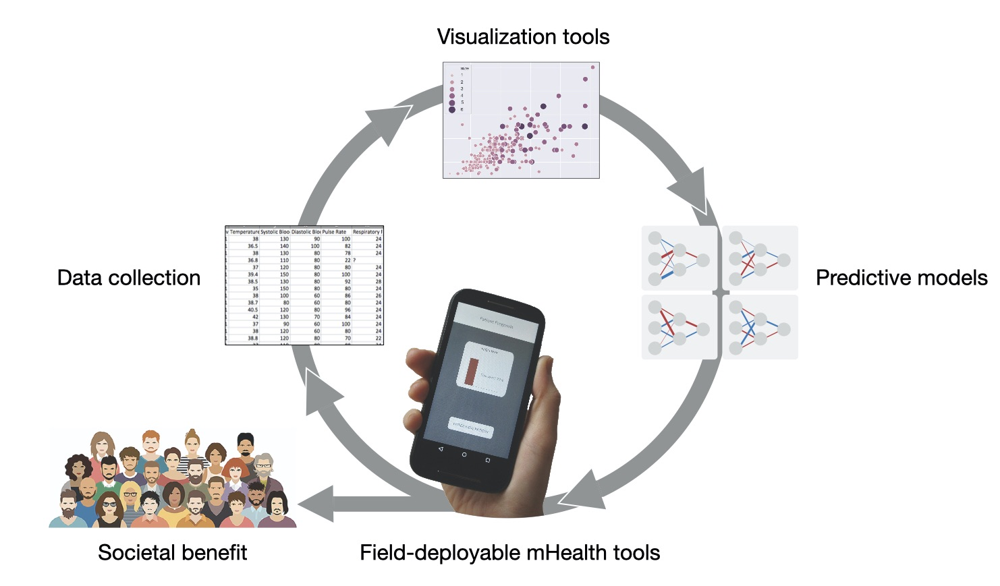
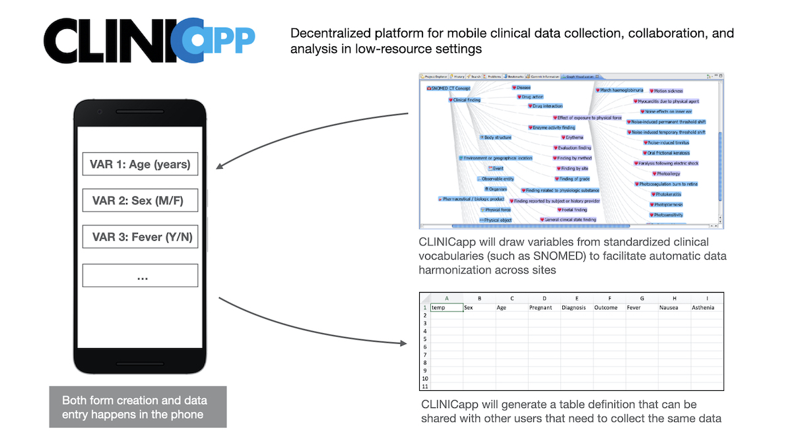
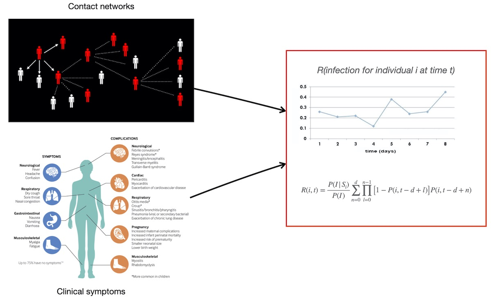

The general aim of this project is to create new machine learning models the can be used across different infectious diseases to predict diagnosis, prognosis, and forecasts, using a combination of data sources, including clinical symptoms, contact networks, and genome sequences. We are currently working on hemorrhagic viral diseases such as Ebola and Lassa fever that particularly affect low income regions in the world where access to clinical care is limited. Therefore, we are interested in translational approaches that could make these models useful through low cost technologies such as mobile phones and rapid diagnostic testing.

<!--more-->

On one hand, there is a a huge interest in the potential of ML approaches to complement human expertise thanks to their capacity of detecting subtle patterns in large datasets, and even to surpass human predictive accuracy in specific domains such as image recognition. On the other hand, ML models are hindered by [incomplete validation](https://www.statnews.com/2020/11/18/covid-19-algorithms-reliability-epic-cerner), lack of evidence on improvement in [patient outcomes](https://jamanetwork.com/journals/jama/article-abstract/2748179), and fundamental [methodological limitations](https://www.technologyreview.com/2020/11/18/1012234/training-machine-learning-broken-real-world-heath-nlp-computer-vision/)) of current ML methods. However, beyond the ongoing hype on ML and "AI", these approaches do give us powerful means to extract quantifiable knowledge that we can used in create tools with medical and public health aplications. Furthermore, useful data-driven tools would incentivize further collection of better and larger datasets, leading to a virtuous cycle:

## ML for clinically-relevant predictions and field-deployable tools

Earlier work I carried out on prognostic models using data from [Ebola](<https://www.thelancet.com/journals/eclinm/article/PIIS2589-5370(19)30096-3/fulltext>) and [Lassa fever](<https://www.thelancet.com/journals/laninf/article/PIIS1473-3099(18)30121-X/fulltext>) patients gives us a foundation to develop new computational pipelines that do not only comprise state-of-the-art ML algorithms, but also data harmonization and validation methods:

These methods are extremely important to overcome inherent challenges faced when collecting of field-data, particularly in low-resource settings, and to make sure that predictive models can have a translational impact. As an example of how these models can be made useful in the field, we developed a prototype app, [Ebola Care Guidelines](https://github.com/colabobio/ebola-care-guidelines), that organizes access to [WHO's materials](https://www.who.int/csr/resources/publications/clinical-management-patients/en/) for clinical managment of patients based on the predictions of the models and which symptoms have the highest contribution to the overall risk of the patient:

Furthermore, the nature of the data used in this research requires strong privacy safeguards during the collection and analysis pipelines, as well as when collaborating with other stakeholders and disseminating the results. Thus, we plan to work on private and decentralized data collection and model development, by creating tools that use standarized vocabularies of clinical variables and allow data sharing and collaboration between users:

## Personalized health assessments from aggregated user health data

Current technologies do not consistently integrate information flows that connect user histories, healthcare providers, vulnerable populations, and third-party actors that may be responsible in quarantine, treatment, information dissemination, and logistical activities. To solve this issue, we not only need new diagnostic tools, but unified, forward-thinking information systems that can detect infectious threats, track their spread, and ultimately guide public-health responses. To design and catalyze the building of such systems, and further motivated the COVID-19 pandemic, we aim to create and pilot a new pathogen surveillance and response model that taps an underused resource: patients. Patients are rarely engaged in the process of their own diagnosis, and the information they share is seldom integrated into public health surveillance and decision-making.

We aim at establishing new paradigm for patient-driven outbreak preemption, engaging patients directly by integrating social networks and connecting information across communities. The project will develop and implement a mobile app, combined with state-of-the-art AI that allows patients to input their symptoms, and receive immediate guidance on how to pursue a differential diagnosis from a set of circulating diseases.

The app will also collect information about patients’ local social activities and contacts to determine whether others in their networks are reporting similar symptoms, and whether those individuals have relevant diagnoses. The underlying statistical framework and infrastructure will enable secure HIPAA compliant data collection, storage, and real-time analysis and visualization. We started constructing models that would underly this app and other related tools, some of which are described in [this preprint](https://arxiv.org/abs/2006.16761), and we expect this to be an important area of work in the lab.

